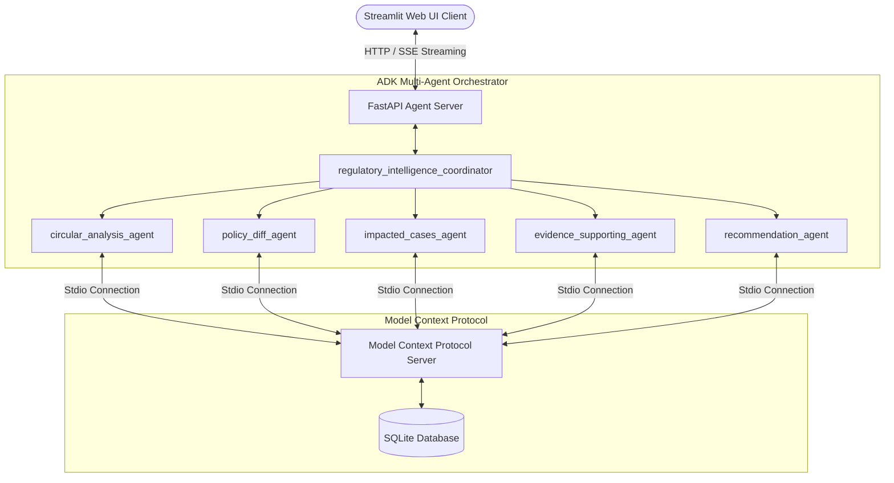

# RegOps-AI: Multi-Agent Regulatory Intelligence and Auditing Platform

RegShield is an agentic compliance auditing platform that automates banking regulation reviews. It leverages a Google Agent Development Kit (ADK) multi-agent orchestrator and a custom Model Context Protocol (MCP) server to analyze regulatory changes (like RBI circulars), compare policy gaps, audit pending customer files, and flag compliance and fraud alerts.

## Key Features

*   **RBI Circular Impact Analysis (Task 1 and 3)**: Paste/upload new regulatory circular text to automatically extract effective dates, affected products, and changed clauses.
*   **Version and Gap Compare (Task 2)**: Detect gaps between new circular guidelines and existing internal Standard Operating Procedures (SOPs).
*   **Loan File Review and Audit (Task 4)**: Audits active database loan files (e.g. `LAP-213`) to check compliance against rules like Video-KYC (V-CIP) onboarding.
*   **Active Fraud Shield**: Queries a fraud advisory database to flag files vulnerable to deepfakes, mock cameras, and GPS spoofing.
*   **Compliance Report Generator (Task 5)**: Downloads a signed markdown compliance audit report including recommendations.

---

## Architecture



---

## Tech Stack

1.  **Core Agent Orchestration**: Google Agent Development Kit (ADK)
2.  **LLM Backend**: Gemini API (`gemini-2.0-flash`)
3.  **Database Bridge**: Model Context Protocol (MCP) Server
4.  **Database**: SQLite (`bank_knowledge.db` pre-seeded with 55+ entries per catalog)
5.  **Backend Web Server**: FastAPI
6.  **Frontend Interface**: Streamlit (Responsive layout)

---

## Quick Start and Setup

### 1. Installation
Clone the repository:
```bash
git clone https://github.com/Vaishnavidixit6/RegShield.git
cd RegShield
```

Ensure you have `uv` installed (Python package manager):
```bash
# Windows
powershell -c "irm https://astral.sh/uv/install.ps1 | iex"
```

Install dependencies:
```bash
uv sync
```

### 2. Environment Configuration
Create a `.env` file in the root directory:
```env
GEMINI_API_KEY="your-gemini-api-key-here"
```

### 3. Initialize and Seed Database
Generate the mock database populated with 55 circulars, 55 SOPs, 55 fraud advisories, and 55 customer loan applications:
```bash
uv run python init_db.py
```

### 4. Running the Platform

Start the FastAPI agent backend server:
```bash
uv run python app/fast_api_app.py
```

In a new terminal window, launch the Streamlit frontend client:
```bash
uv run streamlit run streamlit_app.py --server.port 8501
```

Open **[http://localhost:8501](http://localhost:8501)** in your browser to run the compliance dashboard!

---

## Container Deployment and Cloud Deploy

A production-ready [Dockerfile](file:///c:/Users/ds3/Kaggle_5DayAI/regulatory-agent/Dockerfile) is provided in the repository root.

### Build and Run locally with Docker
```bash
# Build the image
docker build -t regshield:latest .

# Run the container (binding FastAPI on 8000 and Streamlit on 8501)
docker run -p 8000:8000 -p 8501:8501 --env GEMINI_API_KEY="your-api-key" regshield:latest
```

### Deploying to GCP Vertex AI Agent Runtime
The application is pre-configured to deploy directly to Google Cloud Platform's **Agent Runtime** or **Cloud Run**:
```bash
# Install GCP deployment scaffolding target
agents-cli scaffold enhance . --deployment-target agent_runtime

# Deploy the agent configuration
agents-cli deploy
```
